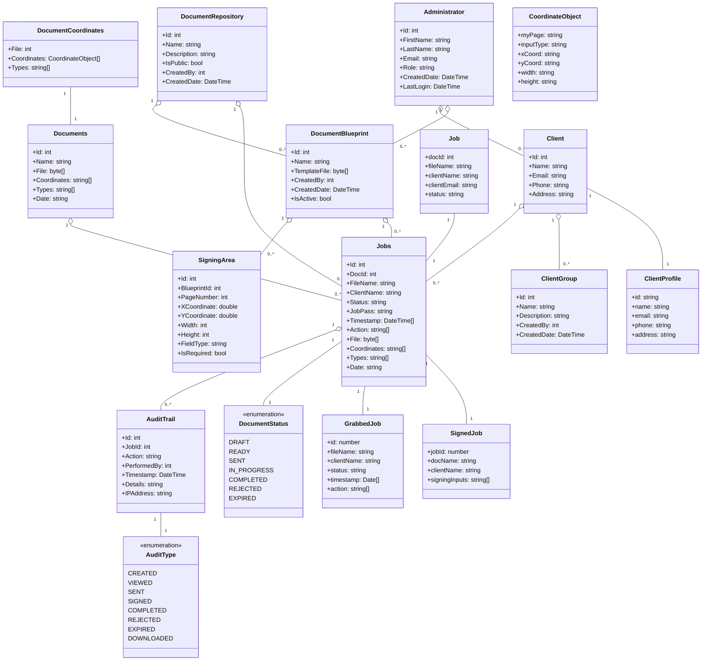

# Domain Model

## Classes

The main users of the system who manage document signing workflows. Admins can upload documents, manage clients, and monitor the signing process. Each admin will have their own login and can customize their experience with favorited documents.

### DocumentBlueprint

Template documents that admins create and reuse. Admins upload a document, set signing areas, and save it as a blueprint. These blueprints can then be used to create multiple signing jobs.

### SigningArea

Defines exactly where clients need to sign on a document. Contains coordinates (X, Y), width, height, and field type (signature, initial, etc.) for each signing location.

### Documents (Current)

Basic PDF storage in the current system. Contains the file data and simple coordinate arrays for signing fields.

### Jobs (Current)

Individual signing tasks created from documents. Tracks the signing process, client information, and basic audit trail using arrays.

### Client

People who need to sign documents. Contains contact information like name, email, phone, and address.

### ClientGroup

Organizes clients into groups for easier management. Allows admins to send documents to multiple clients at once.

### DocumentRepository

Organized storage for documents and templates. Helps admins categorize and manage their document library.
Audit and Status

### AuditTrail

Logs all actions performed on documents. Records who did what, when, and what type of action it was.

### AuditType

Types of actions that can be tracked:
CREATED: New document job created
SENT: Document sent to client
VIEWED: Client opened document
SIGNED: Client signed document
COMPLETED: All actions finished
REJECTED: Document rejected
EXPIRED: Document expired

### DocumentStatus

Current state of a document:
DRAFT: Still being prepared
READY: Ready to send
SENT: Sent to client
IN_PROGRESS: Client is signing
COMPLETED: Fully processed
REJECTED: Rejected by client
EXPIRED: Past due date
Frontend Models

### ClientProfile

Frontend version of Client data for displaying in the UI.

### GrabbedJob

Job information for display purposes, without the full document data.

### SignedJob

Completed signing data with client signatures.
Job (API)
Request data for creating new signing jobs.
DocumentCoordinates
Current system for managing signing field positions.
CoordinateObject
Specific coordinates and dimensions for each signing field.
