# User Manual

## Admin

Admins manage document preparation, sending, and tracking in Cheetah Sign. On the admin side, you can:

- Upload documents
- View uploaded documents
- Build documents for signing
- Combine documents into a packet
- Add, edit, and delete client profiles
- Send documents and packets to clients
- View status of sent jobs
- View audit trails
- View and download signed files

---

### Upload Documents

To send a document to a client, you must upload it first.

1. Go to the **Documents** page.
2. Click the **Upload** button at the top of the page.
3. In the upload modal, click the browse button or upload icon.
4. Select your file and click **Upload**.

Supported file types:

- `.pdf`
- `.doc`
- `.docx`
- `.xlsx`

Maximum file size: **10MB**

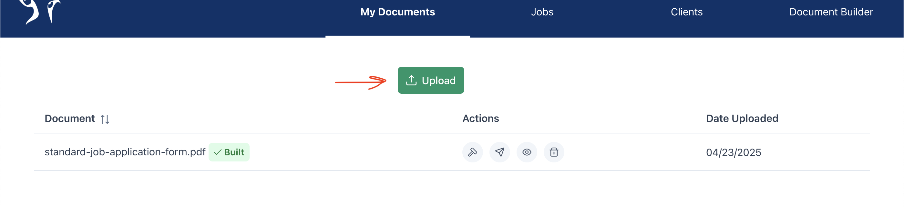
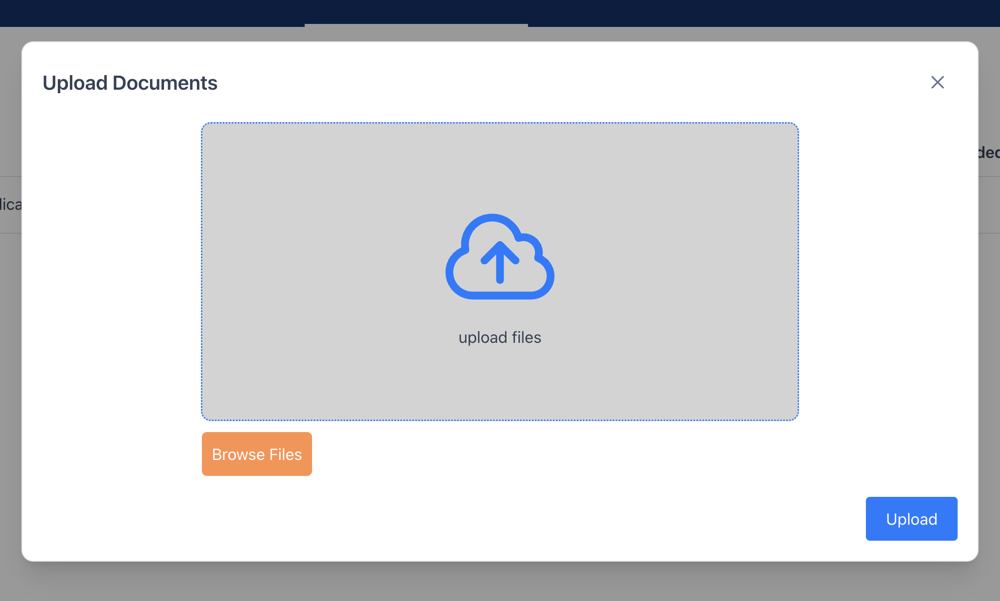

After upload, you should see a confirmation notification that the file is ready to build.

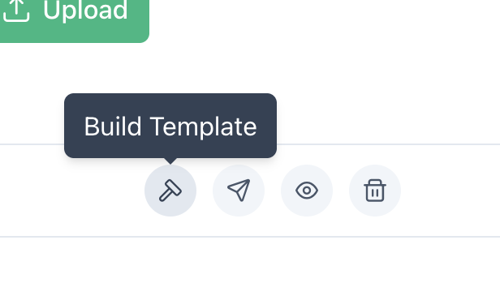

---

### Document Conversion

If you upload a `.doc`, `.docx`, or `.xlsx` file, Cheetah Sign automatically converts it to `.pdf` for use in the signing flow.

---

### After Uploading

All uploaded files appear in the **Documents** page and in the **Documents** tab inside **Document Builder**.

Each document row includes:

- Document name (sortable/filterable)
- Build Template action
- Send action
- View action
- Delete action
- Upload date
- Favorite action

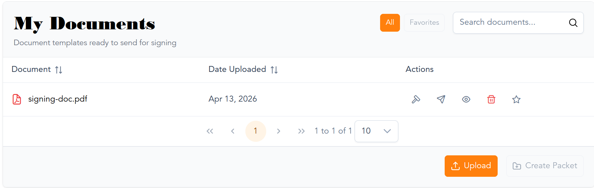

---

### Introducing Document Builder

**Document Builder** lets you place signable/input fields on a document before sending.

1. Open **Document Builder** from your upload confirmation or document actions.
2. Use the **Documents** tab to select an uploaded file.
3. Use the **Edit** tab to add and configure fields.

In Document Builder, you can:

- Add fields to define what recipients must fill out
- Assign fields to specific signers
- Configure packet content
- Prepare documents for one or multiple recipients

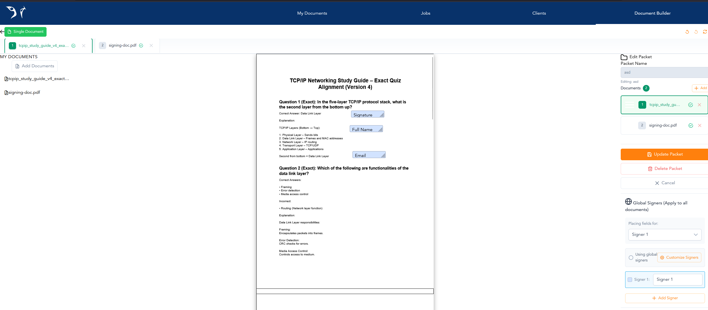
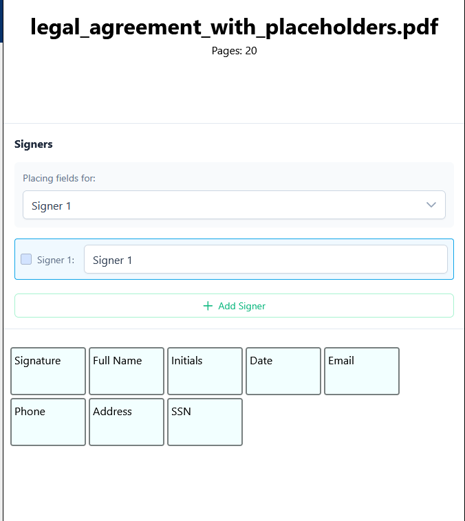
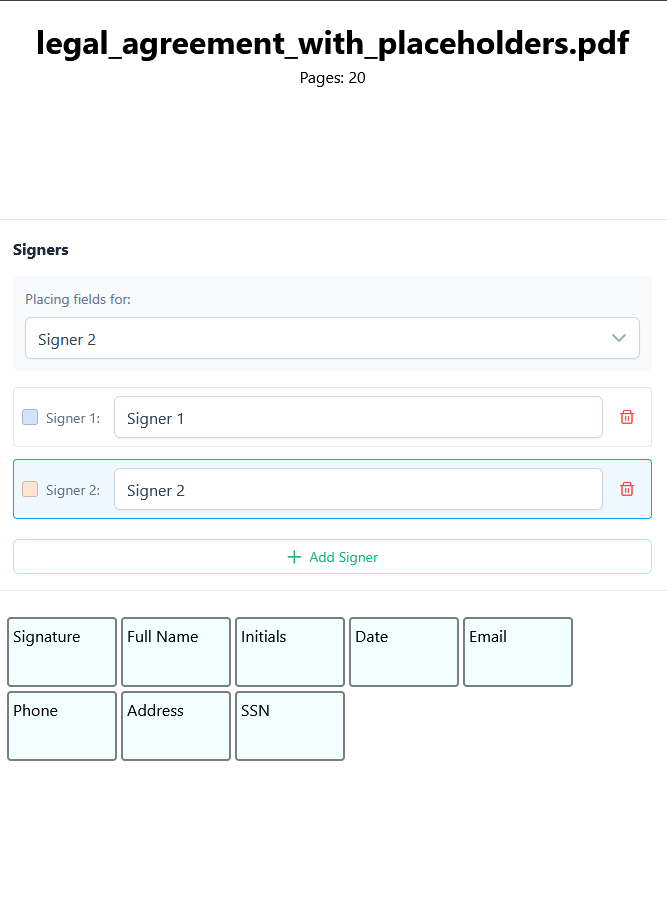

---

### Drag-and-Drop Building

To build a document:

1. Select a document in **Document Builder**.
2. Drag a field type from the field list.
3. Drop it onto the rendered page.
4. Resize or reposition as needed.

You can adjust placement as you build and correct mistakes before sending.

---

### Custom Fields

Custom fields let admins define what information recipients must provide in a document.

At a high level, custom fields are used to:

- Capture required signer inputs in specific places
- Standardize recurring inputs across documents
- Apply preset validation rules where needed

Use custom fields during document building to keep signed outputs complete and consistent.
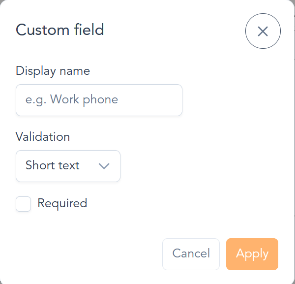

---

### Client Profiles (Create, Edit, Delete)

Use the **Clients** page to manage client records.

#### Add a client

1. Go to **Clients**.
2. Click **Add Client**.
3. Enter client details and save.

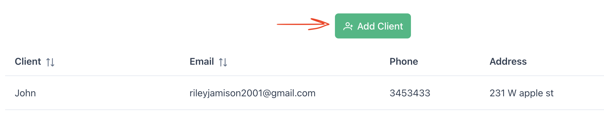

#### Edit a client

1. Go to **Clients**.
2. Use the row action for the client you want to update.
3. Edit any client profile fields (name, email, phone, address fields).
4. Save changes.

#### Delete a client

1. Go to **Clients**.
2. Use the row action for the client you want to remove.
3. Confirm delete.

Deleted clients are removed from the active client list.

---

### Viewing Documents

Use the **View** action on the **Documents** page to preview uploaded or built documents before sending.

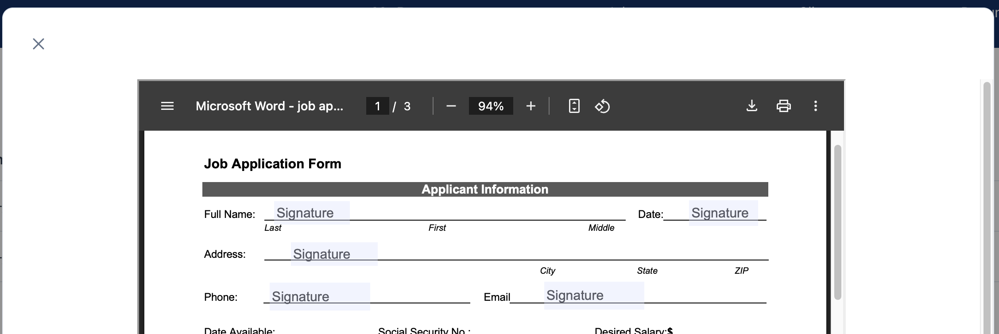

---

### Send Documents to Clients

When a document is built, you can send it as a **job**.

A **job** is a send instance containing:

- The document (or packet)
- Recipient(s)
- Current status

To send:

1. Click **Send** on a document.
2. Select an existing client or enter recipient details.
3. Confirm send.

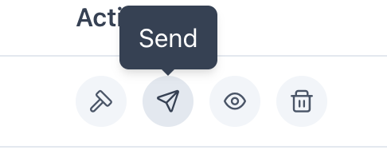
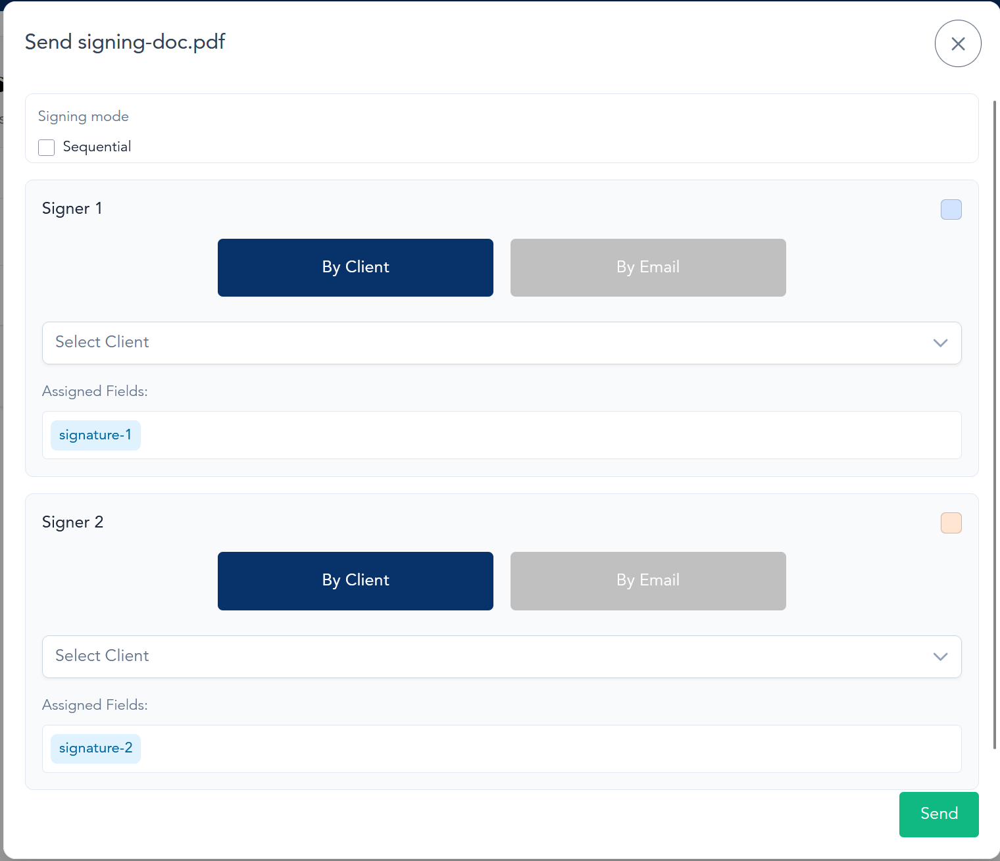

---

### Parallel and Sequential Signing

When sending to multiple recipients, choose signing behavior based on your workflow:

- **Parallel signing**: recipients can sign independently without waiting for each other.
- **Sequential signing**: recipients sign in a defined order.

This is selected during the send workflow. After sending, progress is tracked in **Jobs**.

---

### After Sending (Jobs)

All sent items appear in the **Jobs** page.

Each job row includes:

- Audit Trail action
- Job name (sortable/filterable)
- View Signed File action
- Download Signed File action
- Delete Job action
- Recipient(s)
- Status

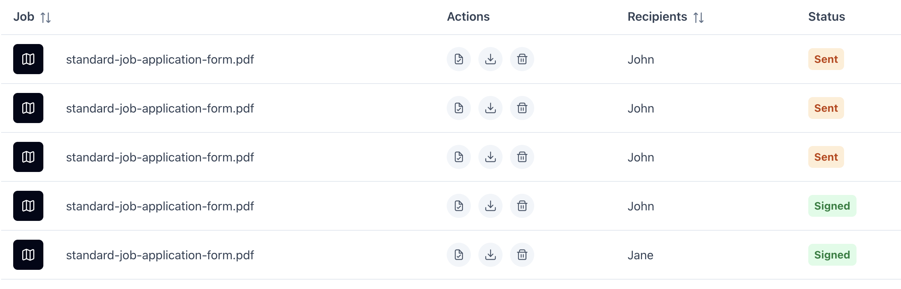
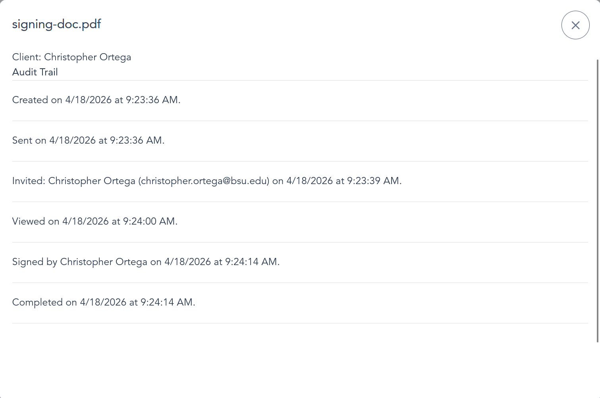

Status examples:

- **Sent** (waiting on signer activity)
- **Signed** (completed)

Each job also includes view/download options for signed outputs.

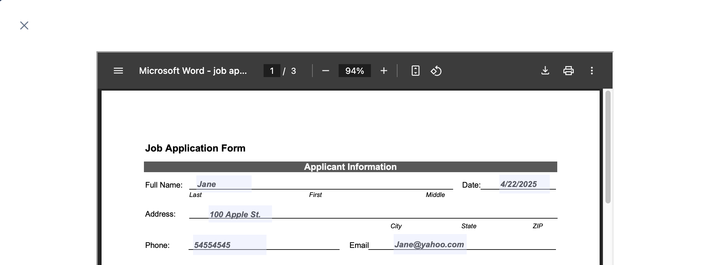

#### Certificate of Completion

For completed jobs, admins can also download the **Certificate of Completion** from the **Jobs** page.
The client will have it sent to their email.
The certificate provides a record of the signing event and can be saved for compliance/audit purposes.

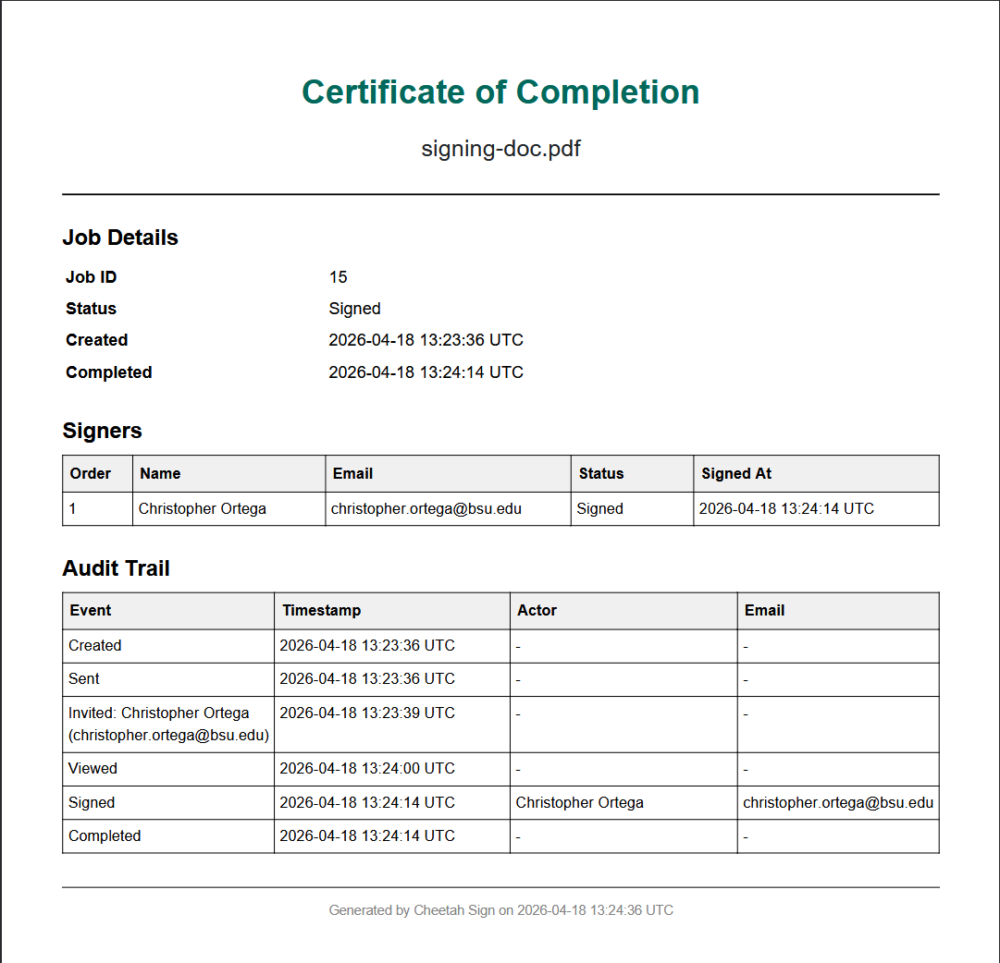

---

## Client

Clients can:

- View documents sent to them
- Sign documents

---

### Open and Review a Sent Document

When an admin sends a document or packet, the client receives an email link.

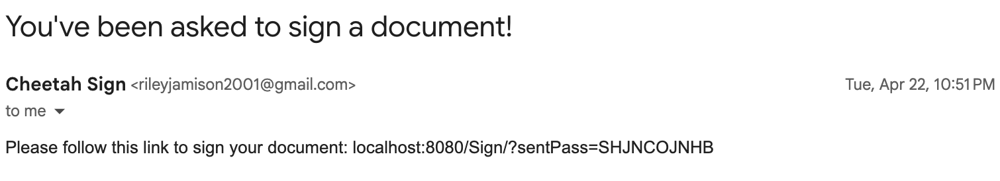

Opening the link takes the client to the signing flow.

---

### Signing Documents

Clients see the document(s) they need to sign and current signing progress.

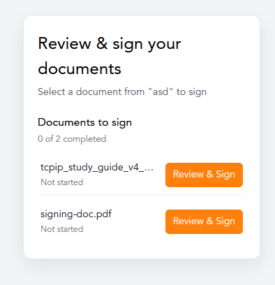

Before signing fields, clients may be prompted to review autofill values and confirm updates.

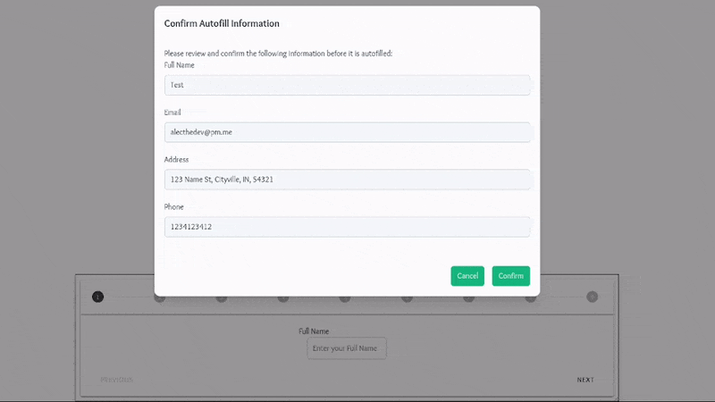

Clients then complete fields using the guided signing steps.

#### Address input behavior

Address is captured using separate fields:

- Address line 1
- Address line 2 (optional)
- City
- State
- ZIP code

These are combined and applied to the document.

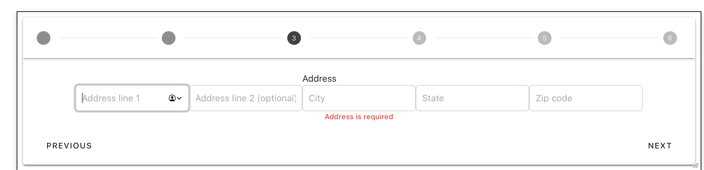

#### Signature options

Clients can sign by:

- Typing their name, or
- Drawing a signature with mouse/trackpad

If drawing is selected, clients can clear and redraw before saving.

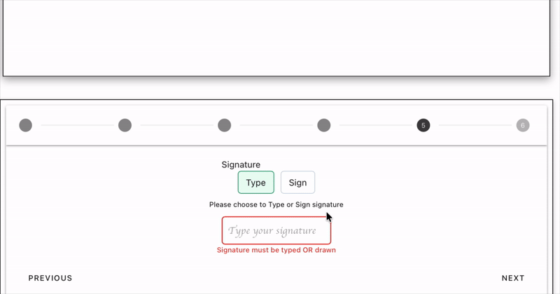

At the end, clients click **Finish** and can download their signed file.

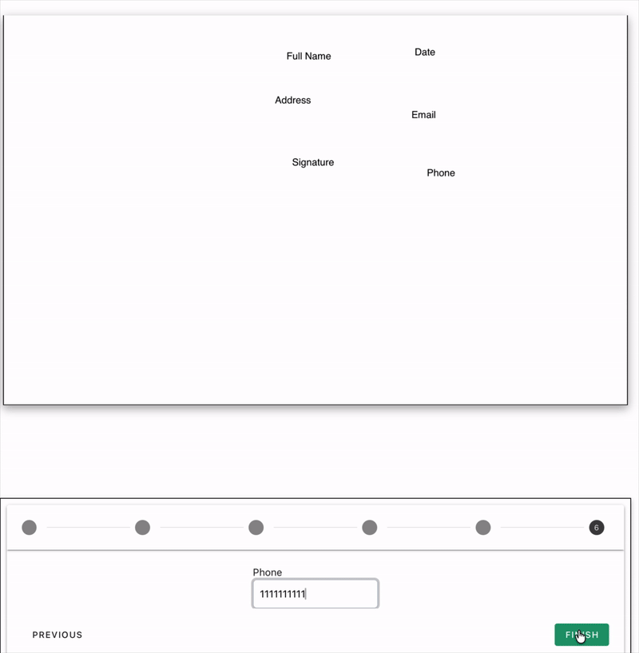

If they do not download immediately, final signed files are sent by email once signing is complete.

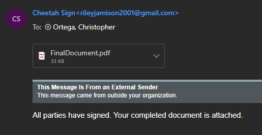
